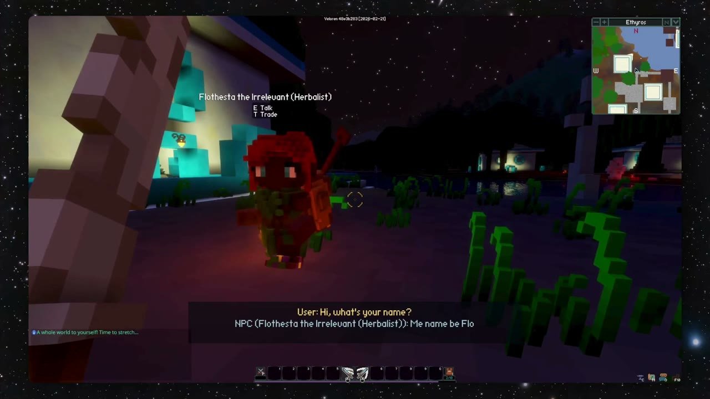

# 🧠 MEMZ — Persistent Memory Layer for Game Characters

### *"Every character remembers. Every interaction matters. Every world is alive."*

[](https://github.com/sid-2209/memz-veloren/actions)
[](https://opensource.org/licenses/GPL-3.0)

---

**MEMZ** is an open-source Rust library that adds a **persistent, LLM-powered memory layer** to every character in a game. Currently integrated with [Veloren](https://veloren.net), a multiplayer voxel RPG.

## 🎥 Demo Video

Click the preview below to watch the Veloren NPC demo on GitHub.

[](public/demo/veloren_npc_demo.mp4)

Prefer a direct link? Open [`public/demo/veloren_npc_demo.mp4`](public/demo/veloren_npc_demo.mp4).

## ✨ Features

- **7 Memory Types** — Episodic, Semantic, Emotional, Social, Reflective, Procedural, Injected
- **Ebbinghaus Forgetting Curve** — Scientifically grounded memory decay
- **Trust-Weighted Gossip** — NPCs spread information through social networks (Dunbar-informed)
- **Player Memory Injection** — Write your character's backstory; the world reacts
- **PAD Emotional Model** — Pleasure-Arousal-Dominance emotional state tracking
- **Sub-2ms Frame Budget** — CI-enforced performance benchmarks
- **Structured LLM Output** — GBNF grammars ensure reliable parsing
- **4-Tier Graceful Degradation** — Works perfectly without any LLM
- **Offline-First** — Local models via Ollama/llama.cpp; cloud is optional
- **Multiplayer-Native** — Server-authoritative memory state

## 🏗️ Architecture

```
memz/
├── memz-core/          # Game-agnostic memory library (publishable to crates.io)
├── memz-llm/           # LLM abstraction layer (Ollama, OpenAI, llama.cpp)
├── memz-veloren/       # Veloren integration (ECS components, systems, hooks)
└── memz-bench/         # CI-enforced benchmark suite (criterion)
```

## 🚀 Quick Start

### Prerequisites

- Rust nightly (edition 2024)
- (Optional) Ollama for local LLM support

### Build

```bash
# Clone the repository
git clone https://github.com/sid-2209/memz-veloren.git
cd memz-veloren

# Build all crates
cargo build

# Run tests
cargo test

# Run benchmarks
cargo bench --bench memory_system
```

### Configuration

Copy `memz.toml` to your game's config directory and customize:

```toml
[llm]
provider = "ollama"
tier1_model = "qwen2.5:1.5b"
tier2_model = "mistral:7b-instruct"

[performance]
frame_budget_ms = 2.0
```

## 📊 Performance Targets (CI-Enforced)

| Benchmark | Target |
|-----------|--------|
| `memory_creation_single` | < 10μs |
| `memory_retrieval_top5_from_200` | < 500μs |
| `memory_decay_pass_50_npcs` | < 50μs |
| `full_frame_budget_20_active_npcs` | < 2ms |
| `observation_pipeline` | < 100μs |
| `gossip_propagation` | < 50μs |
| `reputation_update` | < 20μs |
| `disposition_computation` | < 50μs |
| `eviction_pass_50_npcs` | < 100μs |

## 🧪 Test Suite

- **202 tests** across 4 crates (unit, integration, property-based, golden eval)
- **15 property-based tests** via `proptest` (memory invariant verification)
- **8 integration tests** (full lifecycle, gossip chains, storage budgets)
- **5 golden eval tests** (LLM prompt quality validation)
- **9 criterion benchmarks** with CI budget enforcement
- **Zero clippy warnings** (`clippy::pedantic` enabled)

## 🧪 Cognitive Science Foundation

| Component | Basis |
|-----------|-------|
| Episodic Memory | Tulving (1972) |
| Semantic Memory | Tulving (1985) |
| Procedural Memory | Anderson's ACT-R (1993) |
| Emotional Memory | PAD Model — Russell & Mehrabian (1977) |
| Memory Decay | Ebbinghaus (1885) |
| Social Networks | Dunbar (1996) |
| Belief Updates | Bayesian — Tenenbaum et al. (2011) |
| Metacognition | Flavell (1979) |

## 📝 License

GPL-3.0 — Free and open source forever.

## 🤝 Contributing

See [CONTRIBUTING.md](CONTRIBUTING.md) for guidelines.

---

*MEMZ is not just a mod. It's a thesis statement:  
Games don't need bigger worlds. They need worlds that remember.* 🧠
